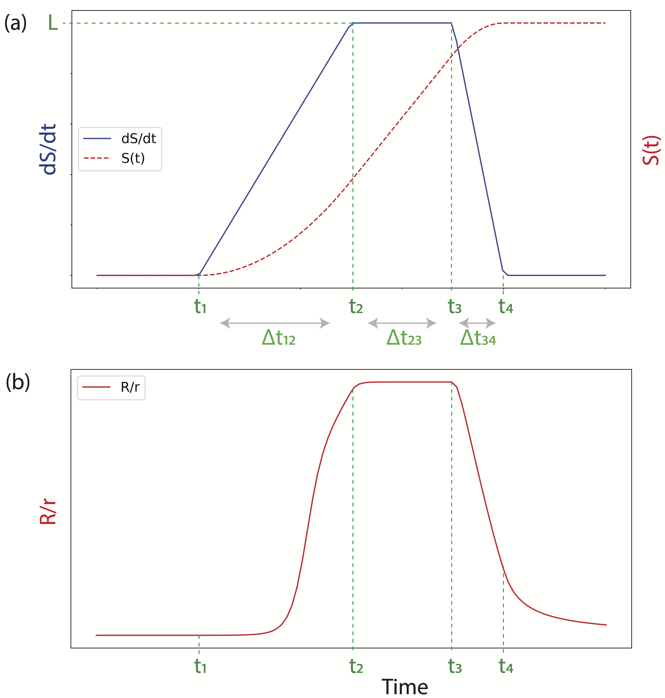
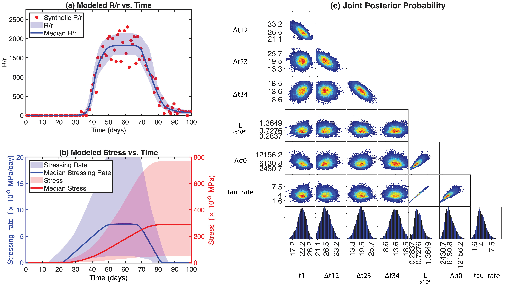

# T-rate: Bayesian Inference of Stress Evolution From Seismicity Rate Observations

<p align="center">
  
</p>

**T-rate** is a Python/PyMC tool for inferring transient stress evolution from changes in seismicity rate. It was developed for seismicity rate observations governed by rate-and-state friction and is demonstrated here using synthetic experiments.

The code was developed for:

Jiang, Y., Trugman, D. T., & González, P. J. (2026).  
*Bayesian inference of complex stress evolution in rate-and-state governed faults constrained by seismicity rate observations*.  
Journal of Geophysical Research: Solid Earth.

---

## 1. Overview

T-rate estimates the timing and amplitude of transient stress-rate histories from observed changes in seismicity rate. The goal of the inversion is to find the stress-rate history that best explains the observed seismicity rate changes.

In the default implementation, each transient source is represented by a **trapezoidal stress-rate function**. For each ramp function, the source parameters are:

$$
L,\quad t_1,\quad \Delta t_{12},\quad \Delta t_{23},\quad \Delta t_{34}.
$$

Here, $L$ defines the peak stress-rate amplitude, $t_1$ defines the onset time, and $\Delta t_{12}$, $\Delta t_{23}$, and $\Delta t_{34}$ define the durations of the ramp-up, plateau, and ramp-down stages. The transition times are:

$$
t_2 = t_1 + \Delta t_{12},
$$

$$
t_3 = t_2 + \Delta t_{23},
$$

$$
t_4 = t_3 + \Delta t_{34}.
$$

The global constitutive/loading parameters are:

$$
\dot{\tau}_r,\quad A\sigma_0.
$$

Here, $\dot{\tau}_r$ is the background stressing rate and $A\sigma_0$ is the effective frictional stress scale.

The characteristic time is calculated internally as:

$$
t_a = \frac{A\sigma_0}{\dot{\tau}_r}.
$$

For a model with $N$ ramp functions, the total number of estimated model parameters is:

$$
2 + 5N.
$$

where the two global parameters are $\dot{\tau}_r$ and $A\sigma_0$, and each ramp contributes five source parameters.



*Figure 1. Stress and seismicity rate ratio under a trapezoidal ramp function stress rate history. (a) Stress rate (blue) and stress history (red), with the characteristic time epochs (t1-t4) highlighted in green. (b) The seismicity rate ratio is derived from the stress history shown in panel (a).*

The physical meaning of the key parameters is summarized below.

| Group | Symbol | Parameter name | Physical definition |
|:---:|:---:|:---:|:---:|
| Source | $N$ | Number of ramp functions | Number of transient stress-rate source functions |
| Source | $L$ | Stress-rate amplitude | Peak amplitude of<br>the transient Coulomb stress rate |
| Source | $t_1$ | Onset time | Start time of<br>transient stress loading |
| Source | $\Delta t_{12}$ | Ramp duration | Duration of stress-rate ramp-up |
| Source | $\Delta t_{23}$ | Plateau duration | Duration of constant stress-rate plateau |
| Source | $\Delta t_{34}$ | Ramp duration | Duration of stress-rate ramp-down |
| Constitutive | $\dot{\tau}_r$ | Background stress rate | Steady-state tectonic shear stressing rate |
| Constitutive | $A\sigma_0$ | Frictional stress scale | Controls seismicity sensitivity to<br>stress changes |
| Constitutive | $t_a$ | Decay time | Characteristic aftershock decay time,<br>calculated as $A\sigma_0 / \dot{\tau}_r$ |
| Constitutive | $R$ | Seismicity rate | Non-earthquake-triggered seismicity rate |
| Constitutive | $r$ | Seismicity rate | Background seismicity rate |

---

## 2. Repository Structure

```text
T-rate/
├── Trate.py
├── run_T_rate_inversion_example.py
├── example_input/
│   └── .gitkeep
├── example_output/example/
├── figures/
│   ├── T_rate_logo.png
│   ├── Figure_parameter_schematic.png
│   └── Figure_control_experiment_results.png
├── README.md
├── requirements.txt
└── LICENSE
```

`Trate.py` contains the reusable T-rate core functions, including the forward model, posterior extraction, and plotting utilities. The Bayesian model setup, including the likelihood choice, is defined in `run_T_rate_inversion_example.py`.

The `run_T_rate_inversion_example.py` file is the user-facing driver script. New experiments can be created by copying and editing this script.

---

## 3. Installation and Quick Start

Create a separate environment:

```bash
conda create -n Trate_env python=3.11
conda activate Trate_env
pip install -r requirements.txt
```

The `requirements.txt` file should include:

```text
numpy
pandas
matplotlib
seaborn
pymc
pytensor
arviz
scipy
tqdm
```

Run the control example:

```bash
python run_T_rate_inversion_example.py
```

The example inversion takes approximately 5–15 minutes on a 4-core machine (10,000 draws + 10,000 tuning steps × 4 chains). The progress bar will appear shortly after the script starts.

The example inversion uses a synthetic input file included in `example_input/`:

```text
example_input/example_input.txt
```

New users do not need to prepare their own catalog before running this example. The example inversion should run without modification if the repository is downloaded completely.

After a successful run, output files should be created in `example_output/example/`. It should contain files such as:

```text
parameters.txt
posterior_summary.txt
R_obs_vs_mod.png
S_modeled.png
trace_plot.png
```

---

## 4. First-Time User Checklist

For a first test, users should:

1. Create and activate the `Trate_env` environment.
2. Run `python run_T_rate_inversion_example.py` without changing anything. The script will take approximately 5–15 minutes to complete. The terminal will show a live progress bar during MCMC sampling — this is normal.
3. Confirm that output files are created in `example_output/example/`.
4. Open `R_obs_vs_mod.png`, `S_modeled.png`, `joint_posterior_probability_kde.png`, and `trace_plot.png`.

---

## 5. What Users Should Modify

For a new application, users should copy one existing driver script and modify the copy.

For example:

```text
run_T_rate_inversion_example.py
```

There are two main places to modify.

### 5.1 `run_inversion()`

This function controls the Bayesian inversion setup, including:

- prior distributions and prior bounds
- number of MCMC draws and tuning steps
- sampler choice
- likelihood choice
- number of chains and CPU cores

Typical parameters to modify include $L$, $t_1$, $\Delta t_{12}$, $\Delta t_{23}$, $\Delta t_{34}$, $A\sigma_0$, and $\dot{\tau}_r$.

In the README and manuscript notation, the Python variable `Asigma_0` corresponds to $A\sigma_0$, and `tau_rate_bg` corresponds to $\dot{\tau}_r$.

For a first trial, choose prior bounds that are broad enough to include the expected transient timing and amplitude.

The example uses 10,000 draws and 10,000 tuning steps in `pm.sample()` to balance runtime and inversion stability. Users may increase the number of draws and tuning steps to obtain more stable posterior estimates and smoother uncertainty ranges, although this will increase the computational time.

### 5.2 Main execution block

The main execution block is:

```python
if __name__ == "__main__":
```

This part controls experiment-level settings, including:

- input data file
- time-bin width `time_bin`
- background seismicity rate $r$
- number of ramp functions $N$, commonly defined in the code as `n_ramps`
- experiment ID
- likelihood option
- output folder

---

## 6. Input Data Format

The example driver script reads:

```text
example_input/example_input.txt
```

This file is a plain text file with **two columns**:

```text
time    R/r
```

where:

- `time` is the middle time of each time bin
- `R/r` is the seismicity rate ratio in that time bin

Example:

```text
0.5      0.0
20.5     0.0
40.5     800.0
50.5     2050.0
80.5     100.0
```

---

## 7. Time Units and Background Rate

The reusable forward model is unit-flexible, but the provided example script uses days as the time unit and Pa/day as the stress-rate unit. If users choose a different time unit, they should also update the prior values and plot labels in the driver/helper scripts. However, the same time unit must be used consistently for:

- time
- time-bin width `time_bin`
- source timing parameters $t_1$, $\Delta t_{12}$, $\Delta t_{23}$, and $\Delta t_{34}$
- background seismicity rate $r$
- background stressing rate $\dot{\tau}_r$

The background seismicity rate $r$ is the long-term or reference seismicity rate. For detailed steps on estimating $R$ and $r$, users should refer to Section 3.2 and the associated sensitivity tests and discussions in Section 4.2 of Jiang, Trugman, and González (2026).

---

## 8. Choosing Key Parameters

### Number of ramp functions

Start with:

```python
n_ramps = 1
```

The reusable functions in `Trate.py` support multiple ramp functions, but the current example driver script is configured for `n_ramps = 1`. To use `n_ramps > 1`, users need to define prior bounds for each additional ramp in `run_inversion()`.

### Timing parameters

The timing parameters are $t_1$, $\Delta t_{12}$, $\Delta t_{23}$, and $\Delta t_{34}$. Choose prior bounds that include the plausible time window of the transient event and physically reasonable durations for the ramp-up, plateau, and ramp-down stages.

### $A\sigma_0$

$A\sigma_0$ is the effective rate-and-state constitutive parameter. In the code, this parameter is named `Asigma_0`. As a practical starting value, users can try:

$$
A\sigma_0 = 1500~\mathrm{Pa}.
$$

This value is motivated by Sirorattanakul and Avouac (2026, Science Advances).

### $\dot{\tau}_r$

$\dot{\tau}_r$ is the background stressing rate. In the code, this parameter is named `tau_rate_bg`.

A practical first-order estimate is:

$$
\dot{\tau}_r = \text{shear modulus} \times \text{strain rate}.
$$

For crustal applications, users may start with a shear modulus of 30 GPa. The strain rate can be obtained from reliable sources such as GPS-based strain rate models (such as Global Strain Rate Model, Kreemer et al., 2014, G3), InSAR-based strain rate models, or other geodetic/experimental constraints.

---

## 9. Output Files

Each run produces output files in `example_output/example/`. The exact output folder name can be modified in the driver script.

The current example script produces the following files:

```text
Inversion_t_obsRr_modRr.txt
R_obs_vs_mod.png
R_r_optimal.txt
R_r_results.txt
S_modeled.png
S_optimal.txt
S_results.txt
dS_optimal.txt
dS_results.txt
joint_posterior_probability_kde.png
parameters.txt
posterior_summary.txt
prior_predictive_check_log.png
trace_plot.png
```

A few key outputs are:

- `R_obs_vs_mod.png`: observed and modeled seismicity rate ratio $R/r$.
- `S_modeled.png`: inferred stressing-rate and cumulative stress histories.
- `joint_posterior_probability_kde.png`: joint posterior probability distribution of the model parameters.
- `trace_plot.png`: MCMC trace plot for checking sampling behavior.
- `posterior_summary.txt`: posterior summary statistics for the key parameters.
- `parameters.txt`: posterior parameter samples.
- `Inversion_t_obsRr_modRr.txt`: time, observed $R/r$, and modeled $R/r$ used in the inversion figure.




*Figure 2. Input data and inversion results for the synthetic example experiment. (a) Observed and modeled seismicity rate ratio, R/r. (b) Modeled stressing rate history and cumulative stress history. (c) Joint posterior probability distribution of the model parameters.*

The synthetic values and informative prior distributions used in the example inversion are summarized below.

| Parameter | Synthetic value | Informative prior distribution |
|:---:|:---:|:---:|
| $L$ | 7500 | $\mathrm{Lognormal}(\mu=\log(6500),\ \sigma=1.0)$ |
| $\dot{\tau}_r$ | 4.1* | $\mathrm{Normal}(\mu=3.7,\ \sigma=2.0)$ |
| $A\sigma_0$ | 7500 | $\mathrm{Lognormal}(\mu=\log(6500),\ \sigma=1.0)$ |
| $t_1$ | 20 | $\mathrm{Uniform}(\mathrm{lower}=10,\ \mathrm{upper}=40)$ |
| $\Delta t_{12}$ | 30 | $\mathrm{Uniform}(\mathrm{lower}=20,\ \mathrm{upper}=40)$ |
| $\Delta t_{23}$ | 20 | $\mathrm{Uniform}(\mathrm{lower}=10,\ \mathrm{upper}=30)$ |
| $\Delta t_{34}$ | 10 | $\mathrm{Uniform}(\mathrm{lower}=5,\ \mathrm{upper}=20)$ |

The posterior parameter file is organized as:

```text
[t1..., delta_t1_t2..., delta_t2_t3..., delta_t3_t4..., L..., Asigma_0, tau_rate_bg]
```

For one ramp:

```text
t1  delta_t1_t2  delta_t2_t3  delta_t3_t4  L  Asigma_0  tau_rate_bg
```

For two ramps:

```text
t1_1  t1_2  delta_t1_t2_1  delta_t1_t2_2  delta_t2_t3_1  delta_t2_t3_2  delta_t3_t4_1  delta_t3_t4_2  L_1  L_2  Asigma_0  tau_rate_bg
```

---

## 10. Potential Applications Beyond the Synthetic Examples

This repository is primarily designed to demonstrate T-rate using synthetic experiments. In the current implementation, the stress source is represented by a trapezoidal stress-rate function, but this function is flexible and can approximate several simpler source types. For example, it can approximate an impulse-like function using very short but non-zero ramp durations to represent an instantaneous stress jump, such as a coseismic Coulomb stress change, or as a boxcar function to represent a period of approximately constant stressing rate, such as a simplified slow-slip event. The same framework may therefore be useful for seismicity rate data from laboratory acoustic emission experiments, earthquake swarms, induced seismicity, and slow-slip-related seismicity or tremor. For these applications, users should carefully define the background seismicity rate $r$, choose a consistent time unit, and set physically reasonable priors based on their experiment, catalog, or independent geodetic constraints. The inferred stress history should be interpreted as an effective stressing history that explains the observed seismicity rate modulation under the assumed rate-and-state model.

---

## 11. Citation

If you use T-rate in your research, please cite:

Jiang, Y., Trugman, D. T., & González, P. J. (2026).  
*Bayesian inference of complex stress evolution in rate-and-state governed faults constrained by seismicity rate observations*.  
Journal of Geophysical Research: Solid Earth.

---

## 12. License

This repository is released under the MIT License. See the `LICENSE` file for details.
